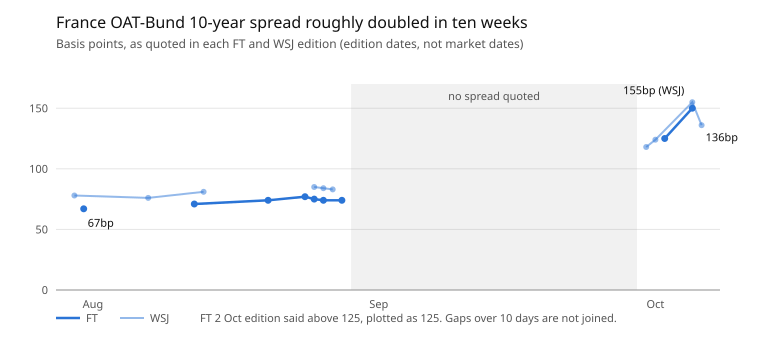

# France Tracker — October 2026

## Bottom line

France went from a quiet fiscal-drift story in late July (10-year OAT-Bund spread of roughly 44-78bp) to the epicentre of the G7 bond sell-off by 2-6 October (10-year yield 4.86-4.96%, spread about 1.4-1.55pp, the widest since the 2011-12 euro crisis, per the FT and WSJ briefs). This tracker covers 28 July to 6 October 2026.

- **Sovereign:** the 10-year was reported near 4.96% in the 2 October editions (highest since mid-2002), settling near 4.86%. The briefs say France has paid more than Italy since mid-August. Scope cut France to A+ in September and Vanguard called its credit "degrading".
- **Trigger is political and fiscal:** PM Lecornu's 2027 budget (EUR 43bn of cuts and tax rises) faces a hung parliament that has already toppled two prime ministers. Le Pen leads polls for April 2027 and Melenchon is rising. The FT calls a Le Pen-Melenchon run-off the worst case for markets.
- **Amplifier is global and technical:** Iran-war energy inflation (French CPI 3.4% in September), a long-end sell-off in every G7 curve, and a forced unwind of long-France/short-Bund carry trades on 1-2 October (short-dated yields moved up to 40bp in two days).
- **The backstop is untested:** the ECB's Transmission Protection Instrument has never been used. Banque de France governor Moulin told the FT the safety net "lies closer to home" and ruled out ECB talk as premature.
- **Real economy is soft, not collapsing:** Q2 GDP +0.2%, drought cost estimated at EUR 10-15bn, record wildfires in the Gironde, and the CAC 40 is among the weakest major indices (-2.3% to -3.9% YTD in the 1-2 October briefs).
- **Corporates now trade tighter than the state:** more than a quarter of investment-grade French companies, including LVMH and Sanofi, yield less than French government debt (Goldman data, FT 6 October).
- **France is also acting abroad:** it held up EU Russia-sanctions renewal to win Usmanov's delisting in a swap for French hostages in Azerbaijan, and co-signed a Franco-German push for a faster EU trade weapon against China.

## Sovereign bond front: the spread doubled in ten weeks

*Source: FT and WSJ daily briefs, 30 Jul to 6 Oct 2026; one WSJ 31 Jul 44bp print excluded as an outlier.*

The move is concentrated in the last week: the briefs quote nothing between 28 Aug and 30 Sep, so the path in between is unknown, and the 10-year yield printed close to 5% before settling near 4.86%.

## Fiscal front: the 2027 budget is the live catalyst

The budget cannot close the gap fast enough for markets, and the political room to do more is shrinking. Figures below are as stated in the briefs; where two briefs disagree both are shown.

| Item | Figure (as reported) | Brief |
|---|---|---|
| 2026 deficit | 5.1% of GDP; 3% by 2029 acknowledged as out of reach without pension and healthcare reform | FT 13 Aug (budget minister Amiel) |
| 2027 budget | EUR 43bn of cuts and tax rises; deficit target 5% vs a 5.4% trajectory | FT, WSJ 2 Oct |
| Savings drive | EUR 54bn quoted in one brief (conflicts with the EUR 43bn above) | FT 1 Oct |
| Debt | 119% of GDP; debt stock about EUR 3.5tn. IMF net-debt measure 108% | FT 2 Oct; FT 1 Sep |
| Interest cost | EUR 62.6bn this year, above the justice ministry budget. WSJ cites debt service up 15% to EUR 91bn | FT, WSJ 2 Oct |
| 2027 issuance | Record EUR 340bn of medium/long-term debt (+10%); 2027 borrowing cost EUR 72.9bn | FT 1 Oct |
| Corporate surtax | Finance minister Lescure says renewal will be "difficult"; about EUR 6bn gap | FT 25 Aug |
| Climate cost | Up to EUR 210bn by 2030, adding 2.2pp of GDP to the deficit (Nixon column) | FT 13 Aug |
| Foreign holdings | More than half of the roughly USD 3.9tn stock is foreign-owned (MUFG) | WSJ 5 Oct |
| Rating | Scope cut France to A+ in September | FT 1 Oct |
| Street reaction | Public-sector strikes in Paris two days before the budget presentation | WSJ 30 Sep |

**ECB backstop.** The ECB raised rates to 2.5% on its second hike this year (WSJ 11 Sep). Isabel Schnabel is leaving early for the IMF, and Lagarde is expected to announce her departure before the French election, with Paris backing Benassy-Quere and Boone for chief economist. FT columnist Bini Smaghi argues ECB quantitative tightening forces banks to hold more sovereign debt just as issuance surges. Multiple insiders told the FT that TPI deployment on France is "just a matter of time"; officials publicly rule it out.

**Radical alternatives.** Melenchon floated cancelling a chunk of ECB-held debt (FT 25 Sep). The FT describes Le Pen and Melenchon platforms as EUR 125bn of cuts funded by a lower retirement age plus a 60%-of-GDP debt cap (FT 6 Oct). Centre-right Edouard Philippe is running on a retirement age of 65.

## Political front: a weak government facing an April 2027 election Le Pen leads

The market is pricing election risk 6-7 months early, because the government needs opposition votes to pass the budget and the presidential race is shaping into a contest between fiscal-loosening platforms.

- **Government:** Lecornu leads a minority government. Two predecessors were ousted over budgets. Budget minister Amiel called state finances a "powder keg" and said the Socialists will "probably oppose" the social-spending cuts needed (FT 13 Aug).
- **Macron:** approval in the "mid- to high teens" amid riots, per Walter Russell Mead in the WSJ on 6 October. The WSJ also reported that his government weighed cutting non-military Ukraine aid over budget pressure (2 Oct).
- **Le Pen:** her candidacy was reinstated on appeal (WSJ 3 Aug), though a 1 October WSJ brief still describes her as appealing a reduced 15-month effective ban. She launched her campaign in Henin-Beaumont on 14 September on a "national preference" platform that would need a constitutional amendment. The FT says she wins most run-off scenarios. She said France "can't afford to keep supporting Ukraine" (WSJ 11 Sep) and, per the FT on 2 October, may let a budget pass given debt-crisis risk while calling some pension measures unacceptable.
- **Bardella:** courted the corporate establishment at a Medef-hosted dinner (WSJ 3 Aug). Mediapart published allegations of antisemitic messages on 1 October, which the WSJ says undercut the party's de-demonisation strategy.
- **Campaign financing:** Credit Agricole and Credit Mutuel are moving toward state-guaranteed campaign loans for 2027 candidates, which would resolve the RN's long-running financing problem (FT 3 Aug).
- **Left and centre:** Melenchon is rising in polls and could face Le Pen in a run-off. Philippe campaigns on fiscal sacrifice and a retirement age of 65.
- **Why it matters beyond France:** the presidential system is winner-takes-all, so no coalition partner would dilute a Le Pen mandate (FT 29 Sep steel-man). Diplomats say France warned a Le Pen win could derail the EU's legislative agenda, so Brussels is fast-tracking budget and climate files (FT 15 Sep).
- **Mood:** Sylvie Kauffmann's op-ed (FT 24 Aug) describes the political class retreating into Gaullist sovereignism. Pope Leo XIV's late-September visit became a political marker: Macron received him at the Elysee but skipped the Masses that Le Pen and Bardella attended (FT 28 Sep).

## Foreign policy and security: assertive abroad, constrained at home

Paris is still an active player on Russia, Ukraine, the Middle East and China trade, but the briefs repeatedly tie its leverage to its fiscal credibility.

- **Sanctions standoff:** France held up renewal of EU sanctions on about 2,600 Russian individuals and entities to win the delisting of oligarch Alisher Usmanov, linked to Azerbaijan releasing French citizens (FT 15 Sep). Other diplomats called it "astonishing". The compromise extended sanctions for three years with Usmanov removed (FT 5 Oct), and an FT op-ed said it exposes Macron's "strategic autonomy" as "just talk".
- **Russia and Ukraine:** Macron called Russia's Kyiv strikes a "policy of terror" (6 Aug). France and the UK detained suspected shadow-fleet tankers (13 Aug) and are transferring Storm Shadow/SCALP cruise-missile technology to Ukraine (25 Aug). French and US intelligence helped Ukraine's refinery-strike campaign (FT 31 Jul). France also issued a deportation order against pro-Kremlin commentator Xenia Fedorova, tied to Bolloré media (30 Jul).
- **Israel and the West Bank:** France, the UK and Canada announced an import ban on goods from West Bank settlements (9 Sep). Foreign minister Barrot defended France's 2025 recognition of Palestine (15 Sep). The FT reported that sanctions on banks and insurers serving settlements are under consideration (21 Sep).
- **China trade:** Macron and Merz co-signed a letter asking the EU to lower the bar for blocking Chinese imports and to gain Section 301-style cut-off power within days (WSJ 6 Oct, ahead of the EU summit and Sefcovic's Beijing trip).
- **Gulf and Red Sea:** France is deploying naval forces to protect a Saudi Red Sea oil port tied to French energy interests (WSJ 25 Sep).
- **Sahel:** Russia's Africa Corps has replaced expelled French forces in Mali, Burkina Faso and Niger (FT 31 Aug, 5 Oct).
- **Defence and deterrent:** an FT essay (22 Aug) groups France with the UK, Italy and Japan as "debt desperados" whose fiscal weakness could erode strategic standing, including the UNSC seat and nuclear deterrent. The FT editorial urged France and Italy to speed SAMP/T NG interceptor deliveries to Ukraine (11 Aug).
- **EU institutions:** Paris and Berlin are pushing to fold the EU diplomatic service under Commission control (FT 4 Sep). Paris is backing two candidates for ECB chief economist.

## Real economy, energy and climate: slow growth, rising inflation, physical shocks

The real economy is adding fiscal pressure rather than offsetting it: growth is thin, inflation is at a post-2023 high, and this summer's fires and drought produced costs the briefs say the budget has not absorbed.

- **Growth and jobs:** Q2 GDP rose 0.2%, matching Germany and Italy inside a 0.4% euro-area beat (FT 31 Jul). Unemployment hit 8.3% in Q2, the highest in nearly six years (FT 13 Aug). The same brief's assumptions section says 9.3%, so treat the figure with care.
- **Inflation:** French CPI reached 3.4% in September, a post-2023 high (WSJ and FT, 1 Oct). Unhedged notes French yields have outrun peers despite lower inflation, which it attributes to election risk (FT 5 Oct).
- **Wildfires:** the Gironde fire burned 42,000 hectares, four times the area of Paris, and forced roughly 220,000-240,000 evacuations. National burned area reached 115,000 hectares, the largest since 1949 (FT 29 Jul), with France's first recorded pyrocumulonimbus events and two firefighter deaths.
- **Industrial exposure:** precautionary closures hit Airbus, Thales, Dassault, Safran and MBDA sites near Bordeaux (WSJ 31 Jul). Finance minister Lescure said 13,000 businesses in evacuated areas were affected and called it "an economic thunderbolt" (FT 28 Jul).
- **Capability gap:** funding for two new Canadair water-bombers was cut in 2024, and only 5-7 of 12 aircraft were operational (WSJ and FT, 30 Jul; the two briefs differ). The FT later credited France's commune-level emergency planning for the low death toll (FT 10 Aug).
- **Drought:** environment minister Barbut estimates EUR 10-15bn (about 0.5% of GDP) against EUR 5.6bn in 2022. Bordeaux white-grape output was cut by a third and red by half (WSJ 1 Sep).
- **Power:** heatwave cooling-water limits shut three EDF reactors in June and July, with EDF's EBITDA expected down 10% this year. EDF plans EUR 87bn of adaptation capex by 2040 (FT 1 Sep).
- **Fuel:** France extended fuel-cost support for high-mileage drivers on 19 September (FT 22 Sep). Air France-KLM's profit fell 70% on doubled jet-fuel costs (FT 31 Jul).
- **Equities:** the CAC 40 has been the weakest major eurozone index YTD in several briefs, at -2.3% (1 Oct) and -3.9% (2 Oct) against the DAX at +2.9%.

## Societal front: institutional strain, sovereignty mood, tighter regulation

The briefs cover society only in fragments, so this section is thinner than the fiscal and political ones. The common thread is public trust in institutions and a turn toward national self-reliance.

- **Security of national assets:** thieves took four Renoir works from the Musee Renoir in Cagnes-sur-Mer, the fourth major French cultural-heritage theft in about a year after the USD 102m Louvre crown-jewels heist (WSJ 9 Sep). The government began pulling vulnerable objects from display cases, and the far-right mayor demanded a national museum-security plan.
- **Unrest:** public-sector strikes hit Paris on 30 September, and the WSJ's 6 October Mead column refers to French riots alongside "bond-vigilante pressure".
- **Religion and ethics:** Pope Leo XIV's France tour drew about 800,000 to a Paris Mass and 150,000 to Lourdes. He denounced assisted dying as "false compassion", engaging France's new end-of-life law (WSJ 28 Sep), and invoked Robert Schuman at Metz in support of European integration (FT 28 Sep).
- **National narrative:** the two-part biopic "La Bataille de Gaulle" drew 5 million viewers, and the FT critic reads it as a response to anxiety over American reliability and strategic autonomy (FT 22 Aug).
- **Consumer and digital rules:** a ban on unsolicited telemarketing without prior consent took effect 11 August (WSJ 6 Aug). The FT also mentions child social-media restrictions (10 Aug) and new penalties on ultra-fast-fashion sales tied to production volumes and repair costs, aimed at Shein (4 Sep).
- **Housing:** the EU's planned Affordable Housing Act would give cities including Paris firmer legal ground to restrict short-term rentals; Airbnb disputes the premise (FT 2 Sep).
- **Information space:** a deportation order against pro-Kremlin commentator Xenia Fedorova, tied to Bollore's media empire (FT 30 Jul).
- **Border friction:** the EU's new biometric entry/exit system worked smoothly in Lisbon and Rome but was chaotic in Paris (WSJ 13 Aug).
- **Climate demographics:** a WSJ item (15 Sep) says heat and drought are pushing buyers and businesses northward from Spain and France, with insurance and property-price data suggesting a structural trend.

## Technology and industrial strategy: capital is arriving, scale is the problem

France's technology news is positive on capital formation and on European consolidation, but the briefs keep returning to scale gaps against US and Chinese rivals.

- **Mistral AI:** raised a record EUR 3bn in a Samsung-led round at a valuation above EUR 21bn, the largest European tech equity round on record (FT, WSJ 9 Sep). It is still far below Anthropic and OpenAI valuations. Earlier talks with Samsung at EUR 20bn were reported on 10 Aug. Lammy warned that a US ban on Chinese open-weight models would "knock the legs out from under" Mistral and similar firms that rely on them (FT 1 Oct). The FT also floated ASML/Mistral among pan-European mega-merger ideas (4 Sep).
- **Space:** Airbus, Thales and Leonardo are combining their satellite businesses ("Project Bromo", targeting a 2027 close). Brussels is using it as the test case for a looser "regional champions" merger policy (FT 2 Oct). Airbus is exploring a sale of its US space unit and talking to Brussels about divesting Toulouse assets to get approval (FT 31 Aug, 29 Sep). The bloc needs 62 launches a year by 2034, and French Guiana is its only equatorial site (FT 29 Sep).
- **Fintech and banking:** Revolut obtained a full French banking licence, with its founder calling France "a leading financial hub" (FT 11 Aug). Societe Generale signed a "strategic agreement" with Anthropic, though CEO Krupa says regulation will keep AI from rapidly transforming client-facing banking (FT 22 Sep).
- **Nuclear and energy tech:** EDF is seeking European co-investors for its Nuward small modular reactor, with Italy in advanced talks (FT 31 Jul).
- **Industrial base:** Alstom's market value roughly halved since the Bombardier deal and new orders fell nearly 40% (FT 31 Aug). Chinese buyers hold stakes in more than 130 European auto-parts makers, concentrated in German and French hubs (FT 12 Aug).
- **Telecom:** Xavier Niel's Vega vehicle holds 18.8% of Vodafone after the e& stake, and analysts expect aggressive cost cutting (FT 28 Jul).
- **Index shifts:** Engie joined Nokia in the Euro Stoxx 50 replacing Volkswagen and Wolters Kluwer (FT 22 Sep).

## Business and corporate: luxury is soft, banks are earning, big deals get punished

French corporates are being judged separately from the state, and mostly more kindly, but luxury, rail equipment and the Schneider deal show real stress. Items are in rough order of weight.

| Company | Development | Brief |
|---|---|---|
| LVMH | Fashion and leather returned to +1% organic growth after seven quarters (28 Jul). Later trades at a discount to Ralph Lauren for the first time in over a decade (18 Aug). WSJ puts it in its short list on China weakness (5 Oct). Arnault family consolidating control in one holding vehicle (25 Sep). Armani minority-stake talks with LVMH, L'Oreal and EssilorLuxottica: sellers want about EUR 10bn, buyers see EUR 3-7bn (29 Sep) | FT, WSJ |
| Hermes | Down 10-11% on China-demand fears despite 7% constant-currency growth | FT, WSJ 30 Jul |
| Kering | Q2 sales +2% to EUR 3.65bn, first growth since 2023. Net debt cut from EUR 8bn to EUR 3.3bn after the EUR 4bn beauty sale to L'Oreal. Gucci still -2%. New CEO Luca de Meo is cutting prices (WSJ 18 Aug) | FT 29 Jul |
| L'Oreal | Record 21.3% beauty operating margin; plans to triple Gucci-branded beauty sales | FT 30 Jul |
| Societe Generale | Record Q2 net profit EUR 1.79bn (+23%) and EUR 1.5bn buyback (31 Jul). Strategy update targets EUR 1.9bn gross cost savings and more than EUR 21bn of shareholder returns by 2029 (22 Sep) | FT |
| Schneider Electric | USD 22.6-23.7bn all-cash PTC bid (the two briefs differ), funded by EUR 16-17bn of new debt plus EUR 5-6bn of equity. Shares fell 10% and about EUR 15bn of market value went, against Lex's EUR 2bn synergy estimate | FT, WSJ 6 Oct |
| Air Liquide | Elliott Management built an activist stake in the EUR 111bn company, targeting a 21% vs 30% margin gap to Linde | FT 2 Sep |
| Alstom | Market value below EUR 8bn from EUR 17.6bn after Bombardier; new orders -40%; lost a Spanish high-speed tender; ex-PM Castex (now SNCF) publicly criticised delivery | FT 31 Aug |
| Airbus | Bordeaux-area fire closures (30-31 Jul); US space unit sale explored; Toulouse asset divestments discussed with Brussels for the Leonardo/Thales space deal | FT, WSJ |
| TotalEnergies | EU exemption lets it keep selling Yamal LNG to Asia, about USD 400m a year (29 Jul). Mozambique LNG inquest adds legal and reputational overhang (21 Sep) | FT |
| EDF | Reactor shutdowns in the heatwave; EUR 87bn adaptation capex to 2040 | FT 1 Sep |
| Air France-KLM | Profit -70% on jet fuel; binding bid for up to 49.9% of TAP, competing with Lufthansa | FT 31 Jul |
| Saint-Gobain | Pushing North American revenue share from 22% toward about 30% | FT 7 Aug |
| Spirits | Pernod Ricard's Brown-Forman talks collapsed; Remy Cointreau's maturing inventory is about double annual sales, a glut risk (WSJ 31 Aug) | WSJ 24, 31 Aug |
| Deals | Partners Group nearing a roughly EUR 2bn purchase of Aroma-Zone from Eurazeo (6 Aug); Shein faces French and EU penalties (4 Sep) | FT |
| AXA | The ICC ended its health-insurance contract with Axa to avoid US-sanctions exposure (2 Oct) | FT |

## Credit and counterparty items

Credit Agricole appears in two briefs, and French sovereign exposure now features in the counterparty section of both papers' 1-2 October editions.

- **Credit Agricole, Italian bank M&A:** Monte dei Paschi's EUR 70bn twin all-share bid for Banca Generali and Banco BPM needs Credit Agricole's cooperation as a large Generali shareholder. Its public line was "nothing can happen against us or without us" (FT 21 Aug). The FT's 6 October brief says Meloni's government opposes the Intesa-MPS consolidation as "dismemberment" of Italy's oldest bank.
- **Credit Agricole, campaign finance:** Credit Agricole and Credit Mutuel were reported moving toward state-guaranteed campaign loans to 2027 presidential candidates (FT 3 Aug), which the FT says would normalise financing for the RN.
- **French sovereign exposure:** the FT treats the spread action, the downgrade and Vanguard's wording as a systemic counterparty signal for anyone with French bank, insurer or OAT-collateral exposure (1 Oct). The WSJ says the same for CAC 40-adjacent exposure (2 Oct).
- **Basis-trade losses:** L&G Asset Management and unnamed hedge funds were caught offside buying French bonds against Bunds just before the 2 October sell-off (WSJ 5 Oct). The WSJ brief asks where else the book holds similar European basis trades.
- **Corporate-sovereign inversion:** a quarter of investment-grade French corporates, including LVMH and Sanofi, yield less than the state (FT 6 Oct), so French corporate credit is not priced off the sovereign.
- **Equity calls in the briefs:** short EWQ (6 Oct) and a short on Societe Generale framed around concentrated French sovereign exposure (27 Aug).
- **Sanctions screening:** France's Usmanov demand threatened a full lapse of about 2,600 EU Russia-sanctions listings (15 Sep). The 5 October compromise extended sanctions for three years with Usmanov removed, so screening lists need that update.
- **Questions the briefs themselves pose:** at what spread or political trigger does France become a desk-level trade (WSJ 1 Oct); when does the ECB backstop get tested for France specifically (FT 2 Oct, 25 Sep); and what would the ECB's first G7 TPI deployment look like if the budget fails (FT 6 Oct).

## Caveats, data conflicts and points of challenge

The briefs are model-generated syntheses of FT and WSJ editions, not primary data, and they disagree with each other on several France numbers. Treat the figures here as reported, not verified against market data.

Dates here are edition dates, not market dates: the near-5% peak shows up in the 2 October editions, but the FT of 6 October places it on Friday 2 October and some briefs place it on Thursday 1 October.

- **Spread figures conflict by source and day.** The 2 October spread is above 125bp in the FT and 140bp in the WSJ. The 6 October figure is about 150bp intraday in the FT and 136bp in the WSJ close. Some briefs quote a 1.81pp 2011 peak, which could not be checked.
- **Two clear errors in the briefs.** The 1 October FT brief says France's "spread over Germany hit 4.8%+"; that is the 10-year yield, with the spread near 124bp. The 1 October WSJ brief refers to a Le Pen "2026 presidential race"; the vote is April 2027. The same FT brief says France's spread over Italy is positive by more than 1.2 points, which is hard to square with the 2 October WSJ figures, so that number should not be relied on.
- **Other conflicts:** budget package EUR 43bn vs EUR 54bn; unemployment 8.3% vs 9.3% inside one brief; Canadair availability 5 vs 7 of 12; PTC deal USD 22.6bn vs 23.7bn; Le Pen's legal status (reinstated on appeal vs appealing a 15-month ban).
- **Is this a French story or a global duration shock?** The FT's own steel-man (2 Oct) says Italy's spread moved only 5bp and US equities barely reacted, so the France-specific read is plausible but not proven. Bunds rallied while OATs sold off, which supports idiosyncratic risk. Yet the 1-2 October move was amplified by crowded hedge-fund positioning, per the WSJ, so some of the spread may reverse without any fiscal change.
- **Honest assessment of the "buy the dip" case:** HSBC's Attfield says French debt is the cheapest since 2008 on its own metrics and Royal London AM is buying. The bear case rests on an election more than a year away that markets cannot hedge cleanly. Neither side has a catalyst before the budget vote.
- **Coverage gaps.** Many July-September briefs only note "no France coverage today" or show a bare bond-table figure, so the story is dense in the last two weeks and thin before. The repo also has no weekly briefs for the weeks of 24 Aug, 31 Aug and 14 Sep, and a few daily editions are missing, so continuity is incomplete.

## Watch list and catalysts

The next decisive event is the budget's passage through a hung parliament; the briefs give no vote date, so the dated items below are the surrounding catalysts.

| When | Event | Why it matters |
|---|---|---|
| Weeks of 5 and 12 Oct | Sefcovic's Beijing trip (week of 5 Oct) and the EU leaders' summit the following week, with the Franco-German trade-weapon letter | Tests whether weak leaders in Paris and Berlin can still act together (WSJ 6 Oct) |
| Autumn, no date given | Lecornu 2027 budget through parliament; surtax renewal decision (about EUR 6bn) | Government collapse or a failed OAT auction is the FT's trigger for TPI talk |
| 28 Oct | FOMC meeting; futures price about a 20% chance of a hike (FT 5 Oct) | Global duration backdrop for OATs |
| 29 Oct (possible) | ECB meeting; Capital Economics and Oxford Economics expect a hike, markets evenly split (WSJ 1 Oct) | Higher ECB rates raise French funding costs further |
| 20 Nov | UK-EU summit | Macron's "welcome back" framing; the "Made in Europe" dispute is shelved until then (FT 1 Oct) |
| 29 Nov | Spanish snap election | The FT frames it as a test for how France's 2027 contest could play out |
| Year-end | ECB top-three roles package, with France backing two chief-economist candidates | Lagarde is expected to announce her departure before the French election (FT 15 Sep) |
| April 2027 | Presidential election (one FT brief says a May run-off) | Le Pen leads; a Le Pen-Melenchon run-off is the market's worst case |
| 2027 | Airbus-Thales-Leonardo space combination targets close | First test of looser EU merger policy |

Other open items: Le Pen's appeal and legal status, further rating-agency moves (the WSJ says Le Pen's platform could prompt them), the Bardella scandal's polling effect, and further hedge-fund unwinds in European basis trades.

## Sources and method

Everything above comes from 97 daily and weekly FT and WSJ analysis briefs dated 28 July to 6 October 2026, of which 88 contain real France content. France paragraphs were extracted by keyword (France, French institutions, politicians and companies), excluding "no France coverage today" notes, Absent Stories sections and machine-readable data-tag blocks.

Citations in the sections above give the newspaper and date of the brief. The briefs themselves summarise FT and WSJ articles, and the underlying articles were not opened. The source set has no weekly briefs for some weeks and a few missing daily editions, so continuity before late September is incomplete.
